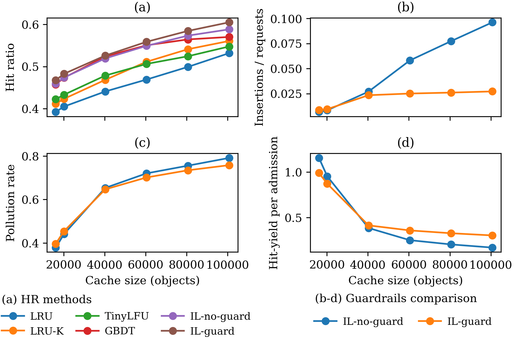
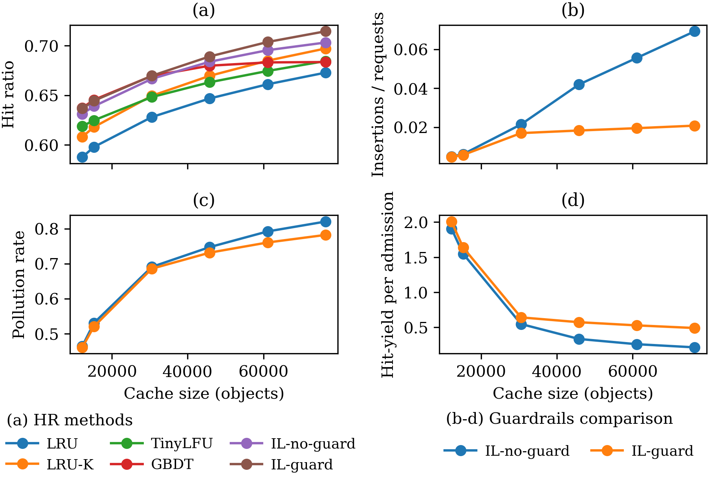
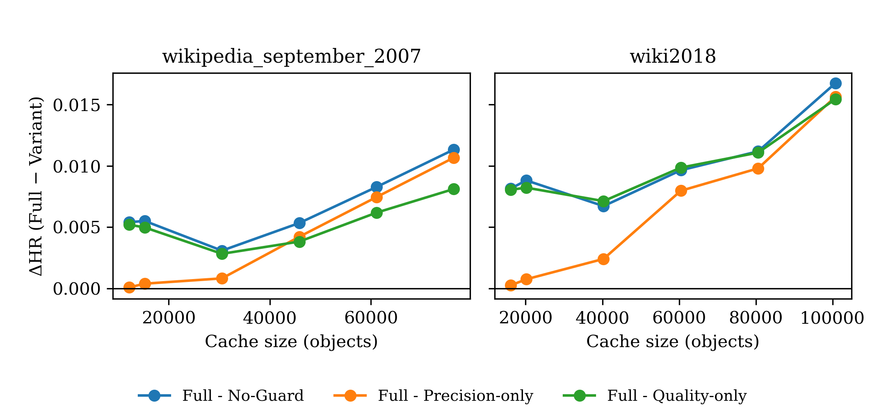
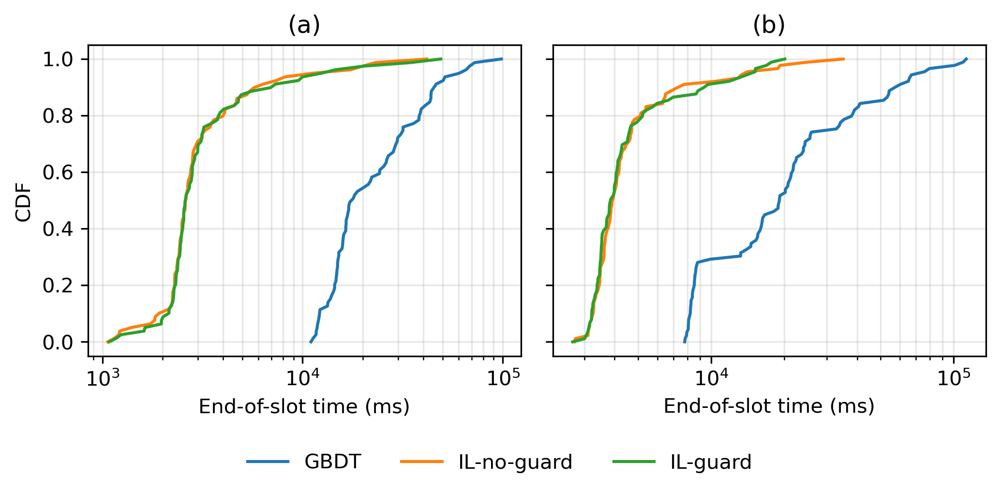

# Edge IL Cache Experiments

This repository contains code for IL-based edge caching experiments (guard/no-guard variants), overhead measurement, and analysis notebooks.

## 1. Project Setup

Create the Conda environment from `environment.yml`:

```bash
conda env create -f environment.yml
```

Activate the environment:

```bash
conda activate edge_il_cache
```

## 2. Dataset Preparation

Important: the experiment scripts expect datasets under `data/raw/...` (not `data/row/...`).

Create dataset folders:

```bash
mkdir -p data/raw/wikipedia_september_2007
mkdir -p data/raw/wiki2018
```

Download datasets:

```bash
# Wikipedia September 2007
curl -L "http://www.globule.org/wiki/2007-09/wiki.1190153705.gz" \
  -o data/raw/wikipedia_september_2007/wiki.1190153705.gz

# Wiki2018 CDN trace (tar.gz)
curl -L "http://lrb.cs.princeton.edu/wiki2018.tr.tar.gz" \
  -o data/raw/wiki2018/wiki2018.tr.tar.gz
```

Convert `wiki2018.tr.tar.gz` to `wiki2018.gz` (10M prefix) using the provided script:

```bash
python scripts/convert_wiki2018.py
```

This script writes:

- `data/raw/wiki2018/wiki2018.gz`

## 3. Run Main Experiments

### 3.1 No Guard

```bash
python src/experiments/run_il_cache_opt022_guard_or_noguard.py \
  --model guard_no_guard \
  --feature-sets A2 \
  --base-learners nb \
  --datasets wikipedia_september_2007 wiki2018
```

### 3.2 Guard

```bash
python src/experiments/run_il_cache_opt022_guard_or_noguard.py \
  --model guard_full \
  --feature-sets A2 \
  --base-learners nb \
  --datasets wikipedia_september_2007 wiki2018
```

## 4. Run Overhead Experiments

```bash
python src/experiments/run_il_cache_overhead_guard.py \
  --dataset wiki2018 \
  --feature-set A2 \
  --base-learner nb

python src/experiments/run_il_cache_overhead_no_guard.py \
  --dataset wiki2018 \
  --feature-set A2 \
  --base-learner nb

python src/experiments/run_gdbt_cache_overhead.py \
  --dataset wiki2018 \
  --feature-set A2
```

## 5. Outputs

- Main experiment outputs: `results/<dataset>/...`
- Overhead outputs: `results/overhead/<dataset>/...`

## 6. Evaluation and Visualization

Evaluation and visualization notebooks are available in `notebooks/`.

The following panels are aligned with the journal draft:

1. Wiki2018 panel  
   `results/figures/cont1_panel_wiki2018.png`

   

2. Wikipedia September 2007 panel  
   `results/figures/cont1_panel_wikipedia_september_2007.png`

   

3. Guardrails component ablation: hit-ratio gap between the full guardrails configuration and ablated variants across cache sizes  
   `results/figures/cont2_ablation_delta_panel.png`

   

4. Overhead panel  
   `results/figures/overhead_cdf_panel.png`

   

You can open notebooks with Jupyter Lab/Notebook after activating the Conda environment.
